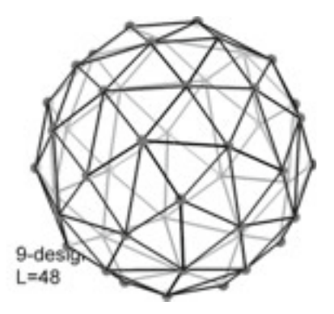
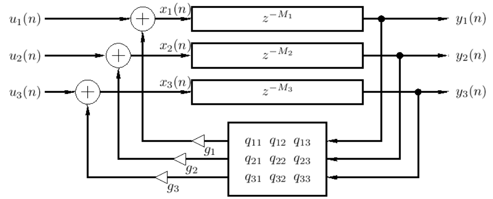

# Überblick über die Präsentation

- Überblick über DirAC

- Annahmen aus der Psychoakustik

- Funktionsweise

- Trennung Direkt- und Diffusanteil

- Upmixing

- Dekorrelationsmethoden

- Hörversuch

- Erste Ergebnisse und Erwartungen

# DirAC: Überblick

- DirAC: "Directional Audio Coding" von Ville Pulkki

- Upmixing-Algorithmus zur Verbesserung der Lokalisationsschärfe und der Diffusität

- Basiert auf Trennung in Direkt- und Diffusanteil der Signale

- Generelle Idee:
  
    * Analyse der Richtung und Diffusität des Schallereignisses
  
    * Synthese des Direktanteils mittels Panning
  
    * Synthese des Diffusanteils mittels eines Dekorrelationsverfahren

# DirAC: Annahmen aus der Psychoakustik

1. DOA: Direction of Arrival

  - ITD

  - ILD
  
  - monaurale cues

2. Diffusität: interaurale Kohärenz

3. Klangfarbe hängt ab von

  - Spektrum
  
  - ITD
  
  - ILD
  
  - interaurale Kohärenz

# DirAC: Annahmen aus der Psychoakustik 2

4. Die wahrgenomme Richtung wird bestimmt von:

  - DOA
  
  - Diffusität
  
  - Spektrum (gemessen in einer Richtung mit Zeit-/Frequenzauflösung des menschlichen Ohrs)

_resultierende Annahme_: Menschen können zu einem Zeitpunkt nur einen Cue pro kritischer Bandbreite dekodieren.

# DirAC: Funktionsweise

# DirAC: Funktionsweise 2

# Ablauf in Matlab/Octave

- B-Format Ausgangssignal

- Fensterung mit Hanning im Zeitbereich

- STFT

- Analyse von Richtungs- und Diffusanteil

- Upmixing auf Lautsprecheranordnung
	- 12 Speaker (Produktionsstudio)
	- T-Design (Ambisonics 4ter Ordnung)

- Trennung/Filterung

- Optional: Dekorrelation

- ISTFT und Overlap-Add

# Trennung Direkt- und Diffusanteil 1

- W(k,n) ... Schalldruck (Omnidirektionales B-Format Signal)

{ width=200px }

- V(m,k,n) ... Schnelle und Schalleinfallsrichtung
	- Auch Blindanteile enthalten!

{ width=300px }

{ width=250px }

{ width=250px }

# Trennung Direkt- und Diffusanteil 2
- Kodierung auf Lautsprecheranordnung

- Filter für Richtungs- und Diffusanteil generieren
	- Array mit Gain-Werten für Lautsprecher
	- 1 Gain-Wert pro Frequenz-Bin und Speaker (= Matrix)

- Filterung im Frequenzbereich
	- Direkt und Diffusanteil aus omnidirektionalem Anteil erzeugen

# Upmixing

- 2 Methoden:
  - Direkt auf abbildende Speakeranordnung
  - Allgemein B-Format höherer Ordnung

{ width=130px }

- T-Design: Erlaubt verlustloses Konvertieren zwischen B-Format und Lautsprecheranordnung

# Dekorrelationsmethoden

- FDN: Feedback Delay Network

Plugin: FdnReverb aus der IEM Plug-in Suite

# Dekorrelationsmethoden 2

- Widening: frequenzabhängiges Panning um die Panningrichtung

Plugin: ambix_widening

- Random Phase: Faltung der Signale mit weißem Rauschen

In octave implementiert: originale DirAC Methode

# Hörversuch 1

- Reaper Projekt gesteuert durch Mushra-Test

- 6 Algorithmen + Referenz

- 4 Testsignale

- Einschätzen von Klangqualität und Räumlichkeit

# Hörversuch 2

6 Algorithmen:

- 12 Speaker, Random Phase Decorrelation

- 12 Speaker, FDN Decorrelation

- T-Design, FDN Decorrelation

- T-Design, Widening Plugin

- Harpex

- Compass

# Hörversuch 3

4 Testsignale

- Synthetisches Zirpen, rotierend in Azimuth

- Synthetisches Zirpen, rotierend in Azimuth, nachträglich verhallt

- Live-Musik Aufnahme

- Umgebungsgeräusche Straßenkreuzung

# Erste Ergebnisse und Erwartungen vom Hörversuch

- FOA Referenz:
  - sehr guter Klangeindruck
  - Lokalisierung nicht besonders gut

- Compass:
  - Nicht gut

- T-Design mit Widening & Harpex:
  - klingen sehr ähnlich
  - guter Klangeindruck
  - gute Lokalisation

- T-Design mit FDN:
  - Erzeugt unnatürlichen zusätzlichen Raum

- 12 Speaker:
  - Artefakte im hochfrequenten Bereich
  - T-Design definitv besser
