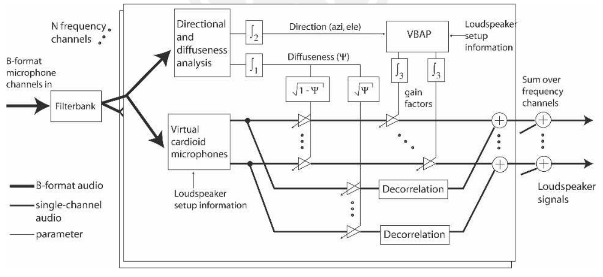

Untersuchung der Klangqualität verschiedener Upmixingmethoden
=============================================================

# Überblick über die Präsentation

- Überblick über DirAC

- Annahmen aus der Psychoakustik

- Funktionsweise

# DirAC: Überblick

- DirAC: "Directional Audio Coding" von Ville Pulkki

- Upmixing-Algorithmus zur Verbesserung der Lokalisationsschärfe und der Diffusität

- Basiert auf Trennung in Direkt- und Diffusanteil der Signale

- Generelle Idee:
  
    * Analyse der Richtung und Diffusität des Schallereignisses
  
    * Synthese des Direktanteils mittels Panning
  
    * Synthese des Diffusanteils mittels eines Dekorrelationsverfahren

# DirAC: Annahmen aus der Psychoakustik

1. DOA: Direction of Arrival

  - ITD
  
  - ILD
  
  - monaurale cues

2. Diffusität: interaurale Kohärenz

3. Klangfarbe hängt ab von

  - Spektrum
  
  - ITD
  
  - ILD
  
  - interaurale Kohärenz

# DirAC: Annahmen aus der Psychoakustik 2

4. Die wahrgenommen Richtung wird bestimmt von:

  - DOA
  
  - Diffusität
  
  - Spektrum (gemessen in einer Richtung mit Zeit-/Frequenzauflösung des menschlichen Ohrs)

_resultierende Annahme_: Menschen können zu einem Zeitpunkt nur einen Cue pro kritischer Bandbreite dekodieren.

# DirAC: Funktionsweise

# DirAC: Funktionsweise 2

# Trennung Direkt- und Diffusanteil

# Mittelung

# Upmixing: Direktanteil

# Upmixing: Diffusanteil

# Dekorrelationsmethoden

# Hörversuch

# Erwartete Ergebnisse

# Ergebnisse
