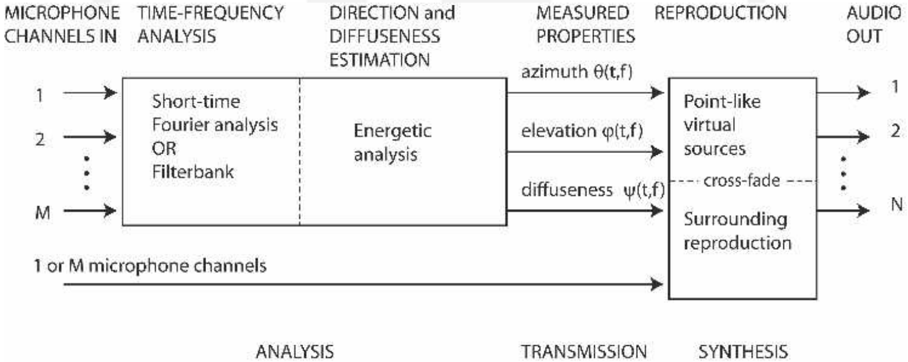

Untersuchung der Klangqualität verschiedener Upmixingmethoden
=============================================================

# Überblick über die Präsentation

- Überblick über DirAC

- Annahmen aus der Psychoakustik

- Funktionsweise

# DirAC: Überblick

- DirAC: "Directional Audio Coding" von Ville Pulkki

- Upmixing-Algorithmus zur Verbesserung der Lokalisationsschärfe und der Diffusität

- Basiert auf Trennung in Direkt- und Diffusanteil der Signale

- Generelle Idee:
  
    * Analyse der Richtung und Diffusität des Schallereignisses
  
    * Synthese des Direktanteils mittels Panning
  
    * Synthese des Diffusanteils mittels eines Dekorrelationsverfahren

# DirAC: Annahmen aus der Psychoakustik

1. DOA: Direction of Arrival

  - ITD

  - ILD
  
  - monaurale cues

2. Diffusität: interaurale Kohärenz

3. Klangfarbe hängt ab von

  - Spektrum
  
  - ITD
  
  - ILD
  
  - interaurale Kohärenz

# DirAC: Annahmen aus der Psychoakustik 2

4. Die wahrgenommen Richtung wird bestimmt von:

  - DOA
  
  - Diffusität
  
  - Spektrum (gemessen in einer Richtung mit Zeit-/Frequenzauflösung des menschlichen Ohrs)

_resultierende Annahme_: Menschen können zu einem Zeitpunkt nur einen Cue pro kritischer Bandbreite dekodieren.

# DirAC: Funktionsweise

# DirAC: Funktionsweise 2

# Ablauf in Matlab/Octave

- B-Format Ausgangssignal

- Fensterung mit Hanning im Zeitbereich

- STFT

- Analyse von Richtungs- und Diffusanteil

- Upmixing auf Lautsprecheranordnung
	- 12 Speaker (Produktionsstudio)
	- T-Design (Ambisonics 4ter Ordnung)

- Trennung/Filterung

- Optional: Dekorrelation

- ISTFT und Overlap-Add

# Trennung Direkt- und Diffusanteil 1

- W(k,n) ... Schalldruck (Omnidirektionales B-Format Signal)

{ width=200px }

- V(m,k,n) ... Schnelle und Schalleinfallsrichtung
	- Auch Blindanteile enthalten!

{ width=300px }

{ width=250px }

{ width=250px }

# Trennung Direkt- und Diffusanteil 2
- Kodierung auf Lautsprecheranordnung

- Filter für Richtungs- und Diffusanteil generieren
	- Array mit Gain-Werten für Lautsprecher
	- 1 Gain-Wert pro Frequenz-Bin und Speaker (= Matrix)
	- Filterung im Frequenzbereich

- Filterung im Frequenzbereich
	- Direkt und Diffusanteil aus omnidirektionalem Anteil erzeugen

# Mittelung

# Upmixing: Direktanteil

# Upmixing: Diffusanteil

# Dekorrelationsmethoden

- FDN: Feedback Delay Network

{width=70%}

Plugin: FdnReverb aus der IEM Plug-in Suite

- Widening: frequenzabhängiges Panning um die Panningrichtung

Plugin: ambix_widening

# Hörversuch

# Erwartete Ergebnisse

# Ergebnisse
